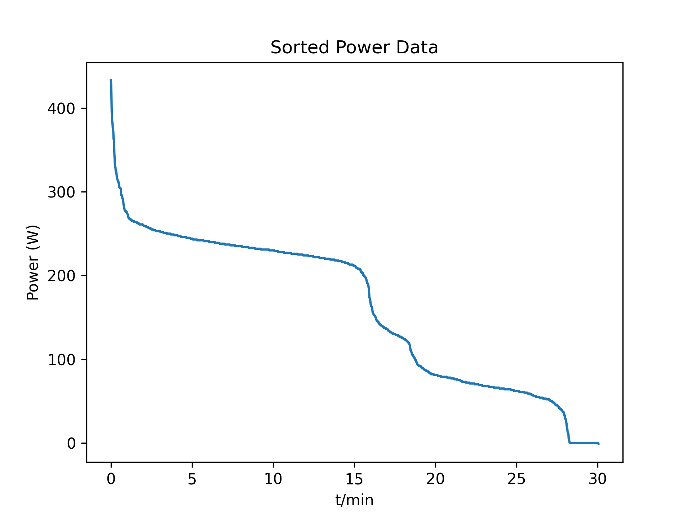

# programmieren_2_aufgabe_1

# Power Curve

> This project reads fictitious sensor data from a CSV file, applies a hand-written bubble sort to organize it, and renders the result as a power curve that illustrates how long a test subject can hold a given power output.

---

## Table of Contents

- [About the Project]
- [Requirements]
- [Installation]
- [Usage]
- [Project Structure]
- [Dependencies]
- [License]
- [Authors]

---

## About the Project

Power data is analyzed and a power curve is generated, showing how long a test subject can maintain a certain power output.



---

## Requirements

- Python >= 3.13
- uv
- Git
- Internet connection for installing dependencies

---

## Installation

### Install uv

**Windows (PowerShell):**
```powershell
powershell -ExecutionPolicy ByPass -c "irm https://astral.sh/uv/install.ps1 | iex"
```

**macOS / Linux:**
```bash
curl -LsSf https://astral.sh/uv/install.sh | sh
```


---

### Clone the Repository

```bash
git clone https://github.com/tjenewein/programmieren_2_aufgabe_1.git
cd programmieren_2_aufgabe_1
```

---

### Install Dependencies

Install all required packages:

```bash
uv sync
```

This will:
- Install all Python dependencies
- Create a virtual environment automatically
- Use the exact versions defined in `uv.lock`

---

## Usage

```bash
# Run the main script
uv run python main.py
```

The generated plot will be saved to the `figures/` folder as a PNG file.

---

## Project Structure

```text
programmieren_2_aufgabe_1/
│
├── figures/                  # Saved plots
│   └── sorted_power.png
│
├── activity.csv              # Input sensor data
├── main.py                   # Main script
├── load_data.py              # Data loading
├── sort.py                   # Bubble sort algorithm
├── pyproject.toml            # Project configuration
├── uv.lock                   # Lockfile
├── .gitignore
├── .python-version
└── README.md
```

---

## Dependencies

All dependencies are defined in `pyproject.toml`.

---

## License

No License

---

### Authors

Anna Kapanke    
Jeremias Koller 
Thomas Jenewein     
GitHub: https://github.com/tjenewein